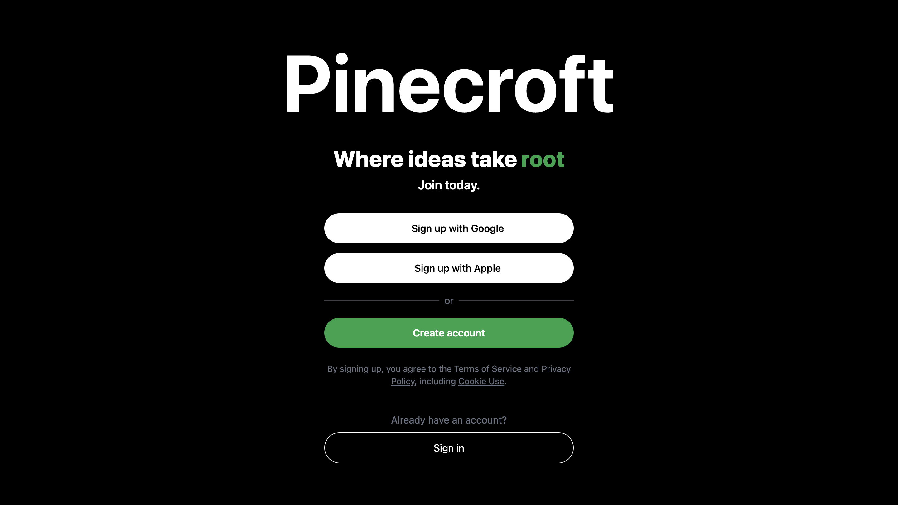
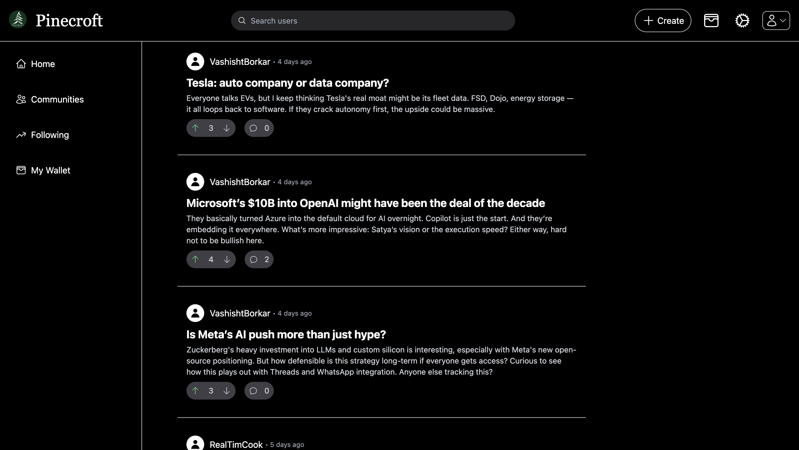
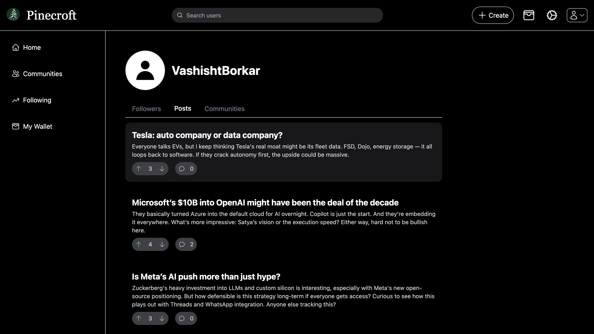
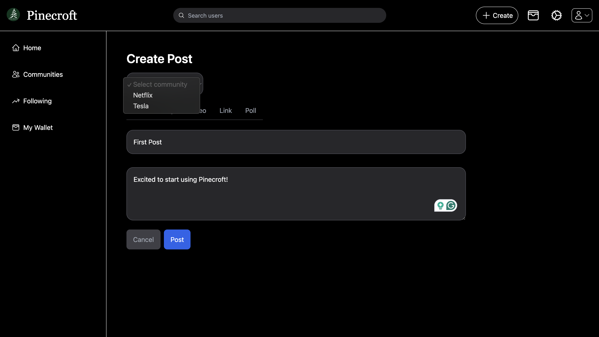

# Pincecroft
A social media platform for commercial investors to discuss, share, and track market insights all in one place.


## Table of Contents
- [Screenshots](#screenshots)
- [Demo](#demo)
- [Tech Stack](#tech-stack)
- [Features](#features)
- [Installation](#installation)
- [Environment Variables](#environment-variables)
- [Running Locally](#running-locally)

---

## Screenshots
<table>
  <tr>
    <td align="center">
      
      <br><sub><b>Landing Page</b></sub>
    </td>
    <td align="center">
      
      <br><sub><b>Home Feed</b></sub>
    </td>
  </tr>
  <tr>
    <td align="center">
      
      <br><sub><b>Profile Page</b></sub>
    </td>
    <td align="center">
      
      <br><sub><b>Post View</b></sub>
    </td>
  </tr>
</table>


## Demo

<a href="https://youtu.be/tnJSi7Vvhak" target="_blank">Link to demo video</a>


---

## Tech Stack

- **Frontend:** React, Tailwind CSS  
- **Backend:** Node.js, Express  
- **Database:** MongoDB (Atlas)  
- **Authentication:** JSON Web Tokens (JWT)  
- **Realtime/Data:** Financial Modeling Prep API   

## Features

- User authentication with JWT
- Social feed with posts, comments, and upvotes
- Join and interact within company-specific communities
- Real-time stock data
- Infinite scroll and pagination on feeds
- Full-text search for users
- Responsive UI optimized for desktop

---

## Installation

```bash
# Clone the repository
git clone https://github.com/VashishtBorkar/pinecroft.git
cd pinecroft

# Install server dependencies
cd server
npm install

# Install client dependencies
cd ../client
npm install
```

## Environment Variables 
```env
MONGO_URI=your_mongo_connection_string
SECRET_KEY=your_jwt_secret
FIN_API_KEY=your_financial_api_key
CLIENT_URL=http://localhost:3000
```

## Running Locally

```bash
# 1. Start the backend server
cd server
npm start

# 2. In a separate terminal, start the React client
cd client 
npm start
```
